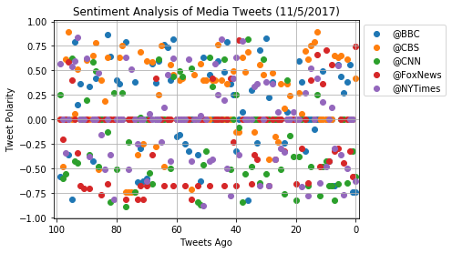
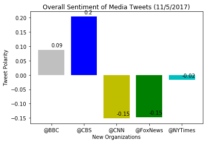

# Twitter News Mood

In this project, I analyzed the sentiment of tweets from the Twitter accounts of major news organizations. To obtain the data for this analysis, I pulled 100 most recent tweets each from BBC, CBS, CNN, Fox and the New York times using Twitter’s Tweepy API. I then analyzed the sentiment of each tweet using the Vader library. Once I had the 100 most recent tweets from each news organization, I converted the Python dictionary where the tweets were stored into a data frame using Pandas. I then exported that file to a csv file. 

Once I had all my data I used first used Matplotlib to produce a scatter plot of the sentiments of every tweet I pulled using the Tweepy API. I then aggregated the data to find the overall sentiment of each news organization’s tweets. I then created a bar graph using Matplotlib. The following are the insights I gained from my analysis:

## Analysis

1. CNN and Fox News had the most negative Vader sentiment analysis.
2. The New York Times had a slightly negative score of -0.02. Even though its score is slightly negative, the New York Times had the scores closes to zero. It is the news outlet with the closest to neutral sentiment.
3. While both the BBC and CBS had an overall positive Vader scores CBS had the highest score with 0.2. the BBC had 0.09.
4. The validity of the Vader analysis is questionable. There are tweets of negative events that have neutral Vader scores instead of expected negative Vader scores.
5. The Vader analysis on news organizations is highly dependent on they type of news happens on a particular day. A more fair analysis would analyze a larger sample of tweets over a larger period of time.


```python
#Dependencies.

import tweepy
import json
import pandas as pd
import numpy as np
import time
from datetime import datetime
import matplotlib.pyplot as plt
import seaborn as sns
```


```python
 # Import and Initialize Sentiment Analyzer.
from vaderSentiment.vaderSentiment import SentimentIntensityAnalyzer
analyzer = SentimentIntensityAnalyzer()
```


```python
#Twitter API keys

consumer_key = "4JPyi4nFzwCJTxf2M6WzKj1xe"
consumer_secret = "JK62tMorfWHYRTQyJggN6JJSra4MHag6h7QLolvWtMVrZ1h0cy"
access_token = "27365820-SLlpBaUtl0ITSCZe9Tdm6nCzpe3Quc4ZPsKyjyDUV"
access_token_secret = "L54XxUoSjFnLsXd0zDHfG57ziW2hE5PmdOm0OLmA3D47z"
```


```python
# Setup Tweepy API Authentication.

auth = tweepy.OAuthHandler(consumer_key, consumer_secret)
auth.set_access_token(access_token, access_token_secret)
api = tweepy.API(auth, parser=tweepy.parsers.JSONParser())
```


```python
#Get tweets from each news organization's twitter feeds.


# A list to hold sentiments.

sentiments = []

target_users = ("@BBC", "@CBS", "@CNN", "@FoxNews", "@NYTimes")

#Loop though target users.

for user in target_users:
    
    #Counter 

    counter = 0
    
    #Loop through 5 pages of tweets for each news organization.


    #Get all tweets from the homefeed of each news organization.

    public_tweets = api.user_timeline(user, count = 100)

        #Loop through all tweets.

    for tweet in public_tweets:

        #Run the Vader analysis on each tweet.

        compound = analyzer.polarity_scores(tweet["text"])["compound"]
        pos = analyzer.polarity_scores(tweet["text"])["pos"]
        neu = analyzer.polarity_scores(tweet["text"])["neu"]
        neg = analyzer.polarity_scores(tweet["text"])["neg"]
        tweets_ago = counter
        tweet_text = tweet["text"]

        #Add sentiments for each tweet to the sentiments list.

        sentiments.append({"User" : user,
                           "Date": tweet["created_at"],
                           "Compound" : compound,
                           "Positive" : pos,
                           "Negative" : neg,
                           "Neutral" : neu,
                           "Tweets Ago" : counter,
                           "Tweet Text" : tweet_text})
        #Add to counter.

        counter = counter + 1

```


```python
#Create DataFrame.

news_sentiments = pd.DataFrame.from_dict(sentiments)
news_sentiments
```


<div>
<style>
    .dataframe thead tr:only-child th {
        text-align: right;
    }

    .dataframe thead th {
        text-align: left;
    }

    .dataframe tbody tr th {
        vertical-align: top;
    }
</style>
<table border="1" class="dataframe">
  <thead>
    <tr style="text-align: right;">
      <th></th>
      <th>Compound</th>
      <th>Date</th>
      <th>Negative</th>
      <th>Neutral</th>
      <th>Positive</th>
      <th>Tweet Text</th>
      <th>Tweets Ago</th>
      <th>User</th>
    </tr>
  </thead>
  <tbody>
    <tr>
      <th>0</th>
      <td>-0.7430</td>
      <td>Sun Nov 05 22:27:18 +0000 2017</td>
      <td>0.247</td>
      <td>0.701</td>
      <td>0.052</td>
      <td>RT @BBCSport: Some sad news to bring you.\n\nF...</td>
      <td>0</td>
      <td>@BBC</td>
    </tr>
    <tr>
      <th>1</th>
      <td>-0.7351</td>
      <td>Sun Nov 05 21:32:03 +0000 2017</td>
      <td>0.267</td>
      <td>0.733</td>
      <td>0.000</td>
      <td>🤦😂 @LiamPayne &amp;amp; @gregjames, a fake moustac...</td>
      <td>1</td>
      <td>@BBC</td>
    </tr>
    <tr>
      <th>2</th>
      <td>0.5574</td>
      <td>Sun Nov 05 20:49:53 +0000 2017</td>
      <td>0.000</td>
      <td>0.825</td>
      <td>0.175</td>
      <td>RT @BBCOne: Q: How many tickles does it take t...</td>
      <td>2</td>
      <td>@BBC</td>
    </tr>
    <tr>
      <th>3</th>
      <td>0.3818</td>
      <td>Sun Nov 05 20:47:59 +0000 2017</td>
      <td>0.109</td>
      <td>0.714</td>
      <td>0.176</td>
      <td>RT @bbcstrictly: That shock result has left us...</td>
      <td>3</td>
      <td>@BBC</td>
    </tr>
    <tr>
      <th>4</th>
      <td>0.2732</td>
      <td>Sun Nov 05 20:46:18 +0000 2017</td>
      <td>0.000</td>
      <td>0.826</td>
      <td>0.174</td>
      <td>RT @BBCTwo: Well, you don't see that every day...</td>
      <td>4</td>
      <td>@BBC</td>
    </tr>
    <tr>
      <th>5</th>
      <td>0.4404</td>
      <td>Sun Nov 05 20:46:10 +0000 2017</td>
      <td>0.000</td>
      <td>0.707</td>
      <td>0.293</td>
      <td>RT @BBCOne: Can’t beat a good accessory. 👑 #Bl...</td>
      <td>5</td>
      <td>@BBC</td>
    </tr>
    <tr>
      <th>6</th>
      <td>0.5574</td>
      <td>Sun Nov 05 20:46:01 +0000 2017</td>
      <td>0.000</td>
      <td>0.825</td>
      <td>0.175</td>
      <td>RT @BBCPanorama: Watch our #paradisepapers inv...</td>
      <td>6</td>
      <td>@BBC</td>
    </tr>
    <tr>
      <th>7</th>
      <td>-0.6705</td>
      <td>Sun Nov 05 20:08:11 +0000 2017</td>
      <td>0.191</td>
      <td>0.809</td>
      <td>0.000</td>
      <td>RT @BBCBreaking: At least 27 people killed in ...</td>
      <td>7</td>
      <td>@BBC</td>
    </tr>
    <tr>
      <th>8</th>
      <td>0.0000</td>
      <td>Sun Nov 05 19:35:03 +0000 2017</td>
      <td>0.000</td>
      <td>1.000</td>
      <td>0.000</td>
      <td>🎥 @LouisTheroux meets disaffected former membe...</td>
      <td>8</td>
      <td>@BBC</td>
    </tr>
    <tr>
      <th>9</th>
      <td>-0.4215</td>
      <td>Sun Nov 05 19:02:04 +0000 2017</td>
      <td>0.203</td>
      <td>0.797</td>
      <td>0.000</td>
      <td>When your other half cheats on you with #Stran...</td>
      <td>9</td>
      <td>@BBC</td>
    </tr>
    <tr>
      <th>10</th>
      <td>0.0000</td>
      <td>Sun Nov 05 18:31:08 +0000 2017</td>
      <td>0.000</td>
      <td>1.000</td>
      <td>0.000</td>
      <td>😋 Family favourites at their finest. Check out...</td>
      <td>10</td>
      <td>@BBC</td>
    </tr>
    <tr>
      <th>11</th>
      <td>0.4939</td>
      <td>Sun Nov 05 18:01:02 +0000 2017</td>
      <td>0.000</td>
      <td>0.758</td>
      <td>0.242</td>
      <td>Second hand smoke affects our pets too. 🚭🐶 Via...</td>
      <td>11</td>
      <td>@BBC</td>
    </tr>
    <tr>
      <th>12</th>
      <td>0.0000</td>
      <td>Sun Nov 05 17:29:05 +0000 2017</td>
      <td>0.000</td>
      <td>1.000</td>
      <td>0.000</td>
      <td>It took more than 1 man on a single night to n...</td>
      <td>12</td>
      <td>@BBC</td>
    </tr>
    <tr>
      <th>13</th>
      <td>0.0000</td>
      <td>Sun Nov 05 17:01:05 +0000 2017</td>
      <td>0.000</td>
      <td>1.000</td>
      <td>0.000</td>
      <td>'It's one of those stories you think you know....</td>
      <td>13</td>
      <td>@BBC</td>
    </tr>
    <tr>
      <th>14</th>
      <td>-0.1027</td>
      <td>Sun Nov 05 16:30:06 +0000 2017</td>
      <td>0.062</td>
      <td>0.938</td>
      <td>0.000</td>
      <td>💰🥃 How much would you pay for a cask of rare S...</td>
      <td>14</td>
      <td>@BBC</td>
    </tr>
    <tr>
      <th>15</th>
      <td>0.0000</td>
      <td>Sun Nov 05 16:02:04 +0000 2017</td>
      <td>0.000</td>
      <td>1.000</td>
      <td>0.000</td>
      <td>#PeakyBlinders series 4 returns to @BBCTwo, We...</td>
      <td>15</td>
      <td>@BBC</td>
    </tr>
    <tr>
      <th>16</th>
      <td>0.0000</td>
      <td>Sun Nov 05 15:32:01 +0000 2017</td>
      <td>0.000</td>
      <td>1.000</td>
      <td>0.000</td>
      <td>Tonight, #BluePlanet2 makes a groundbreaking j...</td>
      <td>16</td>
      <td>@BBC</td>
    </tr>
    <tr>
      <th>17</th>
      <td>-0.3182</td>
      <td>Sun Nov 05 15:00:21 +0000 2017</td>
      <td>0.173</td>
      <td>0.827</td>
      <td>0.000</td>
      <td>Moynaq: The port city that lost its water. 💦 V...</td>
      <td>17</td>
      <td>@BBC</td>
    </tr>
    <tr>
      <th>18</th>
      <td>0.3802</td>
      <td>Sun Nov 05 14:30:05 +0000 2017</td>
      <td>0.000</td>
      <td>0.844</td>
      <td>0.156</td>
      <td>Having a bonfire today? 🔥\nMake sure you think...</td>
      <td>18</td>
      <td>@BBC</td>
    </tr>
    <tr>
      <th>19</th>
      <td>0.5994</td>
      <td>Sun Nov 05 14:00:17 +0000 2017</td>
      <td>0.000</td>
      <td>0.782</td>
      <td>0.218</td>
      <td>From wild goats to woodland walks - here are y...</td>
      <td>19</td>
      <td>@BBC</td>
    </tr>
    <tr>
      <th>20</th>
      <td>0.0000</td>
      <td>Sun Nov 05 13:30:06 +0000 2017</td>
      <td>0.000</td>
      <td>1.000</td>
      <td>0.000</td>
      <td>Can @Joe_Sugg zip it for 30s? \nIf chatting is...</td>
      <td>20</td>
      <td>@BBC</td>
    </tr>
    <tr>
      <th>21</th>
      <td>0.0000</td>
      <td>Sun Nov 05 13:00:08 +0000 2017</td>
      <td>0.000</td>
      <td>1.000</td>
      <td>0.000</td>
      <td>Guy Fawkes: Why do bonfires still burn 400 yea...</td>
      <td>21</td>
      <td>@BBC</td>
    </tr>
    <tr>
      <th>22</th>
      <td>0.0000</td>
      <td>Sun Nov 05 12:01:01 +0000 2017</td>
      <td>0.000</td>
      <td>1.000</td>
      <td>0.000</td>
      <td>🐙 A group of octopuses were seen taking a leis...</td>
      <td>22</td>
      <td>@BBC</td>
    </tr>
    <tr>
      <th>23</th>
      <td>0.0772</td>
      <td>Sun Nov 05 11:00:06 +0000 2017</td>
      <td>0.000</td>
      <td>0.942</td>
      <td>0.058</td>
      <td>🏙By 2050 70% of the world's population will be...</td>
      <td>23</td>
      <td>@BBC</td>
    </tr>
    <tr>
      <th>24</th>
      <td>-0.2349</td>
      <td>Sun Nov 05 10:05:04 +0000 2017</td>
      <td>0.096</td>
      <td>0.852</td>
      <td>0.052</td>
      <td>⚽️✊ When the boys wouldn't let them play footb...</td>
      <td>24</td>
      <td>@BBC</td>
    </tr>
    <tr>
      <th>25</th>
      <td>0.0000</td>
      <td>Sun Nov 05 09:30:26 +0000 2017</td>
      <td>0.000</td>
      <td>1.000</td>
      <td>0.000</td>
      <td>.@LindaRobson58, @tomallencomedy, @misJORGIEPO...</td>
      <td>25</td>
      <td>@BBC</td>
    </tr>
    <tr>
      <th>26</th>
      <td>0.0000</td>
      <td>Sun Nov 05 09:30:09 +0000 2017</td>
      <td>0.000</td>
      <td>1.000</td>
      <td>0.000</td>
      <td>🎬 From the new Pixar animation to Oscar-favour...</td>
      <td>26</td>
      <td>@BBC</td>
    </tr>
    <tr>
      <th>27</th>
      <td>0.0000</td>
      <td>Sun Nov 05 09:24:59 +0000 2017</td>
      <td>0.000</td>
      <td>1.000</td>
      <td>0.000</td>
      <td>RT @BBCWthrWatchers: Morning all! Only one way...</td>
      <td>27</td>
      <td>@BBC</td>
    </tr>
    <tr>
      <th>28</th>
      <td>0.3818</td>
      <td>Sun Nov 05 09:24:54 +0000 2017</td>
      <td>0.000</td>
      <td>0.822</td>
      <td>0.178</td>
      <td>RT @BBCSpringwatch: Stunning capture of puffin...</td>
      <td>28</td>
      <td>@BBC</td>
    </tr>
    <tr>
      <th>29</th>
      <td>0.2263</td>
      <td>Sun Nov 05 09:24:48 +0000 2017</td>
      <td>0.000</td>
      <td>0.917</td>
      <td>0.083</td>
      <td>RT @BBCFood: Heading to the fireworks later? P...</td>
      <td>29</td>
      <td>@BBC</td>
    </tr>
    <tr>
      <th>...</th>
      <td>...</td>
      <td>...</td>
      <td>...</td>
      <td>...</td>
      <td>...</td>
      <td>...</td>
      <td>...</td>
      <td>...</td>
    </tr>
    <tr>
      <th>470</th>
      <td>-0.6249</td>
      <td>Sun Nov 05 12:30:09 +0000 2017</td>
      <td>0.177</td>
      <td>0.823</td>
      <td>0.000</td>
      <td>Detroit is still trying to recover after the 2...</td>
      <td>70</td>
      <td>@NYTimes</td>
    </tr>
    <tr>
      <th>471</th>
      <td>0.0000</td>
      <td>Sun Nov 05 12:21:08 +0000 2017</td>
      <td>0.000</td>
      <td>1.000</td>
      <td>0.000</td>
      <td>Exposures: Puerto Rico in the Dark https://t.c...</td>
      <td>71</td>
      <td>@NYTimes</td>
    </tr>
    <tr>
      <th>472</th>
      <td>0.0000</td>
      <td>Sun Nov 05 12:00:27 +0000 2017</td>
      <td>0.000</td>
      <td>1.000</td>
      <td>0.000</td>
      <td>Tucked away in the GOP tax plan are several pr...</td>
      <td>72</td>
      <td>@NYTimes</td>
    </tr>
    <tr>
      <th>473</th>
      <td>-0.2484</td>
      <td>Sun Nov 05 11:57:51 +0000 2017</td>
      <td>0.153</td>
      <td>0.847</td>
      <td>0.000</td>
      <td>More Anxiety, and More Police, Expected at New...</td>
      <td>73</td>
      <td>@NYTimes</td>
    </tr>
    <tr>
      <th>474</th>
      <td>0.0000</td>
      <td>Sun Nov 05 11:30:09 +0000 2017</td>
      <td>0.000</td>
      <td>1.000</td>
      <td>0.000</td>
      <td>Joe Lockhart was in the crossfire during the C...</td>
      <td>74</td>
      <td>@NYTimes</td>
    </tr>
    <tr>
      <th>475</th>
      <td>0.5106</td>
      <td>Sun Nov 05 11:11:30 +0000 2017</td>
      <td>0.000</td>
      <td>0.784</td>
      <td>0.216</td>
      <td>Field Notes: The Bridal Shop Just Closed. How ...</td>
      <td>75</td>
      <td>@NYTimes</td>
    </tr>
    <tr>
      <th>476</th>
      <td>-0.5106</td>
      <td>Sun Nov 05 11:00:18 +0000 2017</td>
      <td>0.180</td>
      <td>0.820</td>
      <td>0.000</td>
      <td>Youtube contains dark corners as videos that a...</td>
      <td>76</td>
      <td>@NYTimes</td>
    </tr>
    <tr>
      <th>477</th>
      <td>0.6369</td>
      <td>Sun Nov 05 09:50:29 +0000 2017</td>
      <td>0.000</td>
      <td>0.704</td>
      <td>0.296</td>
      <td>Modern Love: Recognizing What They Had, 20 Yea...</td>
      <td>77</td>
      <td>@NYTimes</td>
    </tr>
    <tr>
      <th>478</th>
      <td>0.0000</td>
      <td>Sun Nov 05 09:47:09 +0000 2017</td>
      <td>0.000</td>
      <td>1.000</td>
      <td>0.000</td>
      <td>Global Health: Deadly Plague Outbreak in Madag...</td>
      <td>78</td>
      <td>@NYTimes</td>
    </tr>
    <tr>
      <th>479</th>
      <td>0.0000</td>
      <td>Sun Nov 05 09:45:33 +0000 2017</td>
      <td>0.000</td>
      <td>1.000</td>
      <td>0.000</td>
      <td>The 2018 Michelin Guide New York City has been...</td>
      <td>79</td>
      <td>@NYTimes</td>
    </tr>
    <tr>
      <th>480</th>
      <td>0.0000</td>
      <td>Sun Nov 05 09:28:11 +0000 2017</td>
      <td>0.000</td>
      <td>1.000</td>
      <td>0.000</td>
      <td>The week's 10 most notable new songs, includin...</td>
      <td>80</td>
      <td>@NYTimes</td>
    </tr>
    <tr>
      <th>481</th>
      <td>-0.8126</td>
      <td>Sun Nov 05 09:10:30 +0000 2017</td>
      <td>0.270</td>
      <td>0.730</td>
      <td>0.000</td>
      <td>These musicians are forced to perform for high...</td>
      <td>81</td>
      <td>@NYTimes</td>
    </tr>
    <tr>
      <th>482</th>
      <td>-0.3632</td>
      <td>Sun Nov 05 08:53:20 +0000 2017</td>
      <td>0.180</td>
      <td>0.820</td>
      <td>0.000</td>
      <td>Designers have finally figured out how to dres...</td>
      <td>82</td>
      <td>@NYTimes</td>
    </tr>
    <tr>
      <th>483</th>
      <td>0.0000</td>
      <td>Sun Nov 05 08:36:23 +0000 2017</td>
      <td>0.000</td>
      <td>1.000</td>
      <td>0.000</td>
      <td>How Facebook's algorithm determines the fate o...</td>
      <td>83</td>
      <td>@NYTimes</td>
    </tr>
    <tr>
      <th>484</th>
      <td>-0.5106</td>
      <td>Sun Nov 05 08:18:57 +0000 2017</td>
      <td>0.185</td>
      <td>0.815</td>
      <td>0.000</td>
      <td>Tens of thousands of people in Togo are demand...</td>
      <td>84</td>
      <td>@NYTimes</td>
    </tr>
    <tr>
      <th>485</th>
      <td>-0.1531</td>
      <td>Sun Nov 05 08:00:18 +0000 2017</td>
      <td>0.110</td>
      <td>0.890</td>
      <td>0.000</td>
      <td>‘Saturday Night Live’: Alec Baldwin and Larry ...</td>
      <td>85</td>
      <td>@NYTimes</td>
    </tr>
    <tr>
      <th>486</th>
      <td>0.4767</td>
      <td>Sun Nov 05 07:55:44 +0000 2017</td>
      <td>0.000</td>
      <td>0.807</td>
      <td>0.193</td>
      <td>Japanese art is more than just cliché zen gard...</td>
      <td>86</td>
      <td>@NYTimes</td>
    </tr>
    <tr>
      <th>487</th>
      <td>0.0000</td>
      <td>Sun Nov 05 07:39:18 +0000 2017</td>
      <td>0.000</td>
      <td>1.000</td>
      <td>0.000</td>
      <td>The diversity visa lottery, explained https://...</td>
      <td>87</td>
      <td>@NYTimes</td>
    </tr>
    <tr>
      <th>488</th>
      <td>0.0000</td>
      <td>Sun Nov 05 07:22:38 +0000 2017</td>
      <td>0.000</td>
      <td>1.000</td>
      <td>0.000</td>
      <td>Where the STEM jobs are (and where they aren't...</td>
      <td>88</td>
      <td>@NYTimes</td>
    </tr>
    <tr>
      <th>489</th>
      <td>-0.3818</td>
      <td>Sun Nov 05 07:05:36 +0000 2017</td>
      <td>0.211</td>
      <td>0.690</td>
      <td>0.099</td>
      <td>In 1979, Bob Dylan announced his embrace of Ch...</td>
      <td>89</td>
      <td>@NYTimes</td>
    </tr>
    <tr>
      <th>490</th>
      <td>0.6281</td>
      <td>Sun Nov 05 06:48:21 +0000 2017</td>
      <td>0.053</td>
      <td>0.740</td>
      <td>0.207</td>
      <td>"It didn't matter there was an ocean between t...</td>
      <td>90</td>
      <td>@NYTimes</td>
    </tr>
    <tr>
      <th>491</th>
      <td>0.0000</td>
      <td>Sun Nov 05 06:31:14 +0000 2017</td>
      <td>0.000</td>
      <td>1.000</td>
      <td>0.000</td>
      <td>“Alias Grace” is a story about storytelling an...</td>
      <td>91</td>
      <td>@NYTimes</td>
    </tr>
    <tr>
      <th>492</th>
      <td>0.0000</td>
      <td>Sun Nov 05 06:13:39 +0000 2017</td>
      <td>0.000</td>
      <td>1.000</td>
      <td>0.000</td>
      <td>At a nightclub in Liberia, we found a stylish ...</td>
      <td>92</td>
      <td>@NYTimes</td>
    </tr>
    <tr>
      <th>493</th>
      <td>0.8402</td>
      <td>Sun Nov 05 05:56:02 +0000 2017</td>
      <td>0.000</td>
      <td>0.654</td>
      <td>0.346</td>
      <td>What did Bernie Sanders learn about Canada's h...</td>
      <td>93</td>
      <td>@NYTimes</td>
    </tr>
    <tr>
      <th>494</th>
      <td>0.5927</td>
      <td>Sun Nov 05 05:39:23 +0000 2017</td>
      <td>0.000</td>
      <td>0.806</td>
      <td>0.194</td>
      <td>Wine usually takes the spotlight at Thanksgivi...</td>
      <td>94</td>
      <td>@NYTimes</td>
    </tr>
    <tr>
      <th>495</th>
      <td>0.5423</td>
      <td>Sun Nov 05 05:20:25 +0000 2017</td>
      <td>0.000</td>
      <td>0.759</td>
      <td>0.241</td>
      <td>Op-Ed Contributor: How ISIS helped peace in th...</td>
      <td>95</td>
      <td>@NYTimes</td>
    </tr>
    <tr>
      <th>496</th>
      <td>0.0000</td>
      <td>Sun Nov 05 05:12:58 +0000 2017</td>
      <td>0.000</td>
      <td>1.000</td>
      <td>0.000</td>
      <td>Let the dancing begin💃🕺 https://t.co/cKAXP2Z7WO</td>
      <td>96</td>
      <td>@NYTimes</td>
    </tr>
    <tr>
      <th>497</th>
      <td>-0.3400</td>
      <td>Sun Nov 05 04:56:28 +0000 2017</td>
      <td>0.211</td>
      <td>0.789</td>
      <td>0.000</td>
      <td>Citigroup, 21st Century Fox, Twitter: Prince’s...</td>
      <td>97</td>
      <td>@NYTimes</td>
    </tr>
    <tr>
      <th>498</th>
      <td>0.0000</td>
      <td>Sun Nov 05 04:47:21 +0000 2017</td>
      <td>0.000</td>
      <td>1.000</td>
      <td>0.000</td>
      <td>Trump Arrives in Asia With Focus on Trade and ...</td>
      <td>98</td>
      <td>@NYTimes</td>
    </tr>
    <tr>
      <th>499</th>
      <td>0.5719</td>
      <td>Sun Nov 05 04:35:49 +0000 2017</td>
      <td>0.000</td>
      <td>0.654</td>
      <td>0.346</td>
      <td>Opinion: Why the world loves New York https://...</td>
      <td>99</td>
      <td>@NYTimes</td>
    </tr>
  </tbody>
</table>
<p>500 rows × 8 columns</p>
</div>


```python
#Export the DataFrame to as csv.

news_sentiments.to_csv("Twitter_News_Mood.csv", index=False)
```


```python
#Plot scatterplot graph.

# Set the x limit,
plt.xlim(101, -1)

#plot scatterplot using a for loop.
for user in target_users:
    dataframe = news_sentiments.loc[news_sentiments["User"] == user]
    plt.scatter(dataframe["Tweets Ago"],dataframe["Compound"],label = user)
    
#Add legend
plt.legend(bbox_to_anchor = (1,1))

#Add title, x axis label, and y axis label.
plt.title("Sentiment Analysis of Media Tweets (11/5/2017)")
plt.xlabel("Tweets Ago")
plt.ylabel("Tweet Polarity")

#Set a grid on the plot.
plt.grid()

plt.savefig("Sentiment Analysis of Media Tweets")
plt.show()
```





```python
average_sentiment = news_sentiments.groupby("User")["Compound"].mean()
average_sentiment
```


    User
    @BBC        0.088186
    @CBS        0.203394
    @CNN       -0.150960
    @FoxNews   -0.147275
    @NYTimes   -0.017520
    Name: Compound, dtype: float64


```python
x_axis = np.arange(len(average_sentiment))
xlabels = average_sentiment.index
count = 0
for sentiment in average_sentiment:
    plt.text(count, sentiment+.01, str(round(sentiment,2)))
    count = count + 1
plt.bar(x_axis, average_sentiment, tick_label = xlabels, color = ['silver', 'b', 'y', 'g', 'c'])
#Set title, x axis label, and y axis label.
plt.title("Overall Sentiment of Media Tweets (11/5/2017)")
plt.xlabel("New Organizations")
plt.ylabel("Tweet Polarity")
plt.savefig("Overall Sentiment of Media Tweets")
plt.show()
```





```python

```
